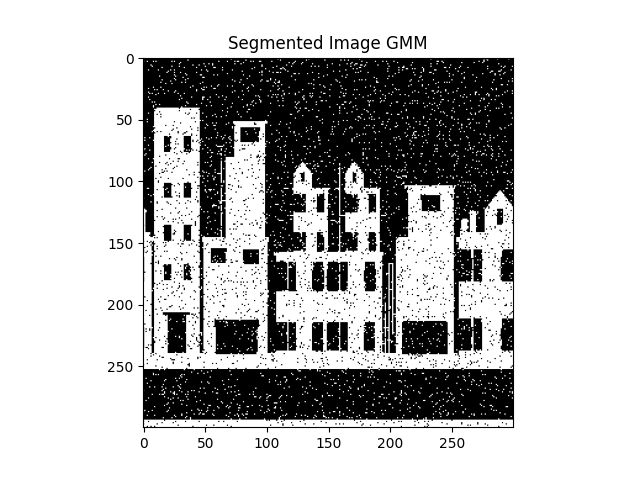
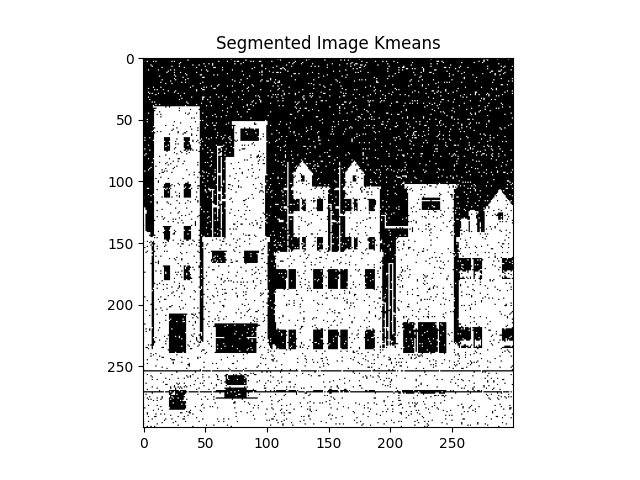

# Quantum Gaussian Mixture Clustering

This repository contains a Python implementation of the paper ["Quantum Clustering and Gaussian Mixtures"](https://arxiv.org/pdf/1612.09199v1) by Mahajabin Rahman and Davi Geiger. This project utilizes quantum wave functions and complex numbers to enhance Gaussian mixture clustering, outperforming traditional methods in terms of accuracy and robustness.

## Table of Contents
- [Introduction](#introduction)
- [Installation](#installation)
- [Usage](#usage)
- [Methodology](#methodology)
  - [Quantum Clustering](#quantum-clustering)
  - [EM Method for Quantum Clustering](#em-method-for-quantum-clustering)
- [Results](#results)
- [Examples](#examples)
- [Contributing](#contributing)
- [Reporting Issues and Mistakes](#reporting-issues-and-mistakes)
- [License](#license)
- [References](#references)

## Introduction

Clustering is a fundamental task in data analysis, commonly used in computer vision and other fields. Traditional Gaussian Mixture Models (GMM) combined with the Expectation-Maximization (EM) algorithm are widely used for this purpose. However, this repository implements a novel approach inspired by quantum interference phenomena, reformulating the classical model using wave functions. This quantum method provides more accurate estimations and is more robust to deviations from Gaussian assumptions.

## Installation

To run the code, ensure you have Python installed. You can install the necessary dependencies using `pip`:

```sh
pip install -r requirements.txt
```

## Usage

To perform Quantum Gaussian mixture clustering on your image, you can use the following command:

```sh
python quantum_gmm.py --input <Path to the input Image File> --output <Path to the output Image File> --components <Number of Cluster> --iter <Number of Iteration>
```

## Methodology

### Quantum Clustering

In this approach, each class distribution is represented by a wave function whose magnitude square corresponds to the class Gaussian distribution. The mixture of class wave functions results in the mixture wave function, with the final probability distribution being the magnitude square of this mixture wave function. This introduces quantum interference effects that enhance clustering performance.

### EM Method for Quantum Clustering

The Expectation-Maximization (EM) algorithm is adapted for the quantum clustering method:

#### E-step:
Calculate the expected value of the latent variables given the current parameters.

#### M-step:
Maximize the expected log-likelihood to update the parameters.

## Results

The quantum method outperforms classical Gaussian mixture methods by providing more accurate and stable parameter estimations, especially in cases with overlapping distributions. The following figures illustrate the improvements:






## Examples

The Jupyter notebook file contains sample scripts demonstrating how to apply the quantum Gaussian mixture clustering to various images.

## Contributing

I welcome contributions to enhance this project. To contribute, follow these steps:

1. Fork this repository.
2. Create a new branch.
3. Make your changes.
4. Submit a pull request.

## Reporting Issues and Mistakes

If you encounter any mistakes or issues in the code, i greatly appreciate your help in making this project better. Please follow the steps below to report any problems:

1. **Check Existing Issues**: Before submitting a new issue, please check the [Issues](https://github.com/mrpintime/Quantum_Gaussian_Mixtures_Clustering/issues) tab to see if your problem has already been reported. This helps us avoid duplicate reports and consolidate efforts.

2. **Create a New Issue**:
   - Go to the [Issues](https://github.com/mrpintime/Quantum_Gaussian_Mixtures_Clustering/issues) tab in the repository.
   - Click on the `New Issue` button.
   - Provide a descriptive title for your issue.
   - In the issue description, please include:
     - A detailed description of the problem.
     - Steps to reproduce the issue, if applicable.
     - Any relevant code snippets, screenshots, or logs.
     - The environment and version details (e.g., operating system, Python version, etc.).

3. **Use Labels**: If possible, apply appropriate labels to your issue (e.g., `bug`, `enhancement`, `question`). This helps us categorize and prioritize the issues more efficiently.

4. **Stay Updated**: After submitting an issue, you can track its progress and participate in discussions by following the issue. I may request additional information or clarification to help resolve the problem.

5. **Contribute Fixes**: If you are able to fix the issue yourself, feel free to submit a pull request. Please follow the contribution guidelines provided in the repository.

I value your feedback and contributions, and i strive to address issues promptly. Thank you for helping improve this project!

## License

This project is licensed under the MIT License. See the `LICENSE` file for more details.

## References

- Rahman, M., & Geiger, D. (2016). ["Quantum Clustering and Gaussian Mixtures"](https://arxiv.org/pdf/1612.09199v1).

